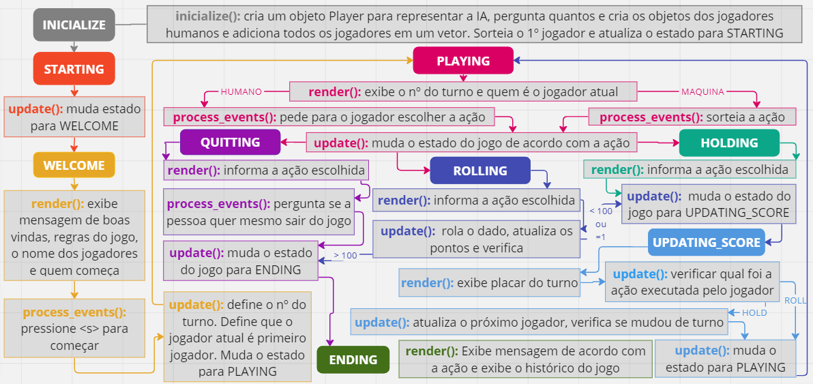

# Pig Dice Game

Esse projeto é uma versão do jogo Pig Dice para um trabalho da disciplina "Programação I", do curso de Bacharelado em Ciência da Computação da Universidade Federal do Rio Grande do Norte (UFRN). 

**Autoras:** [Júlia Maria A. Guilhermino](https://github.com/JuhGuilhermino) e [Ludmilla Rodrigues](https://github.com/Ludrodrigues), <ludmillarodr178@gmail.com>

## Como Executar
ESCREVER AQUI

## Desafios Encontrados

#### Arquiteura Game Loop
O principal desafio nesse projeto foi implementar a arquitura Game Loop. Antes de começar a programação, sentimos a necessidade de discutir como trabalhar com os difentes estados para que as ações ocorrecem na ordem correta. 
Para facilitar esse processo também optamos por não ultilizar na integra o template ofertado pelo professor. Mas procuramos estudar o código e acabamos utilizando algumas estruturas que fizeram sentido pra gente.
Geramos vários esquemas diferentes em uma ferramenta chamada [Miro](https://miro.com/app/dashboard/). O mais recente e que decidimos implementar foi o aprensetado abaixo:

O outro grande desafio foi o uso do MAKE ESCREVER AQUII!!!!!!
